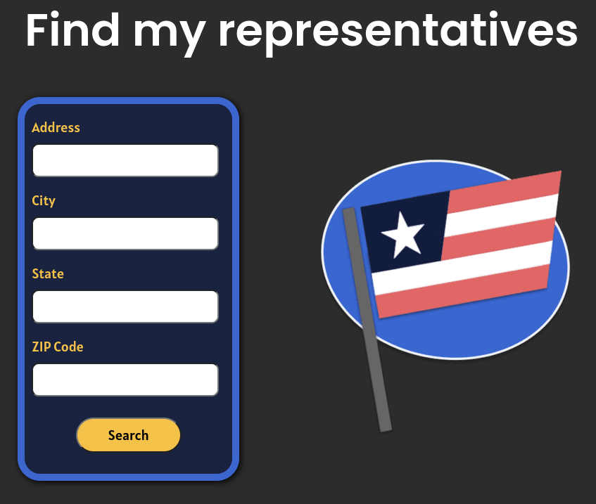
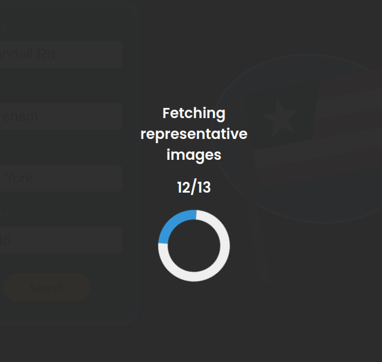

# Find my representatives

See federal, state, city, and local political representatives for any U.S. address 
 
**Note:** *This site doesn't use an image API. It uses Selenium to scrape Base64 images individually from a Google Images query, so they take longer to load.* 
 
**07-20-2024 update:** *For some reason `socket.io` has stopped working in Firefox. Chrome still shows the image fetch updates.* 

### [Live demo 🔗](https://jeffvalcher.com/reps)

## Screenshots

## Frameworks, libraries

- Express backend
- vanilla JS templating engine
- Node Selenium image scraper
- socket.io for displaying progress when fetching images

## Data sources

- Google Civic Information API
- Google Images
