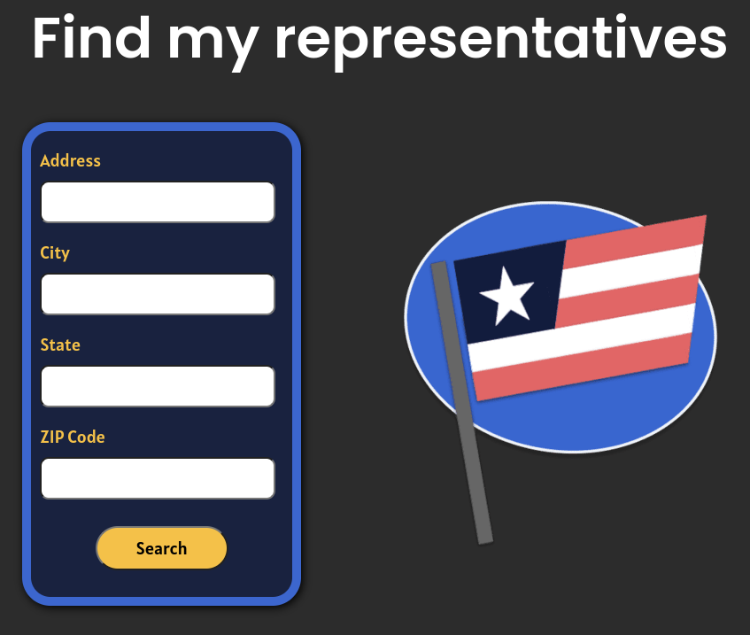
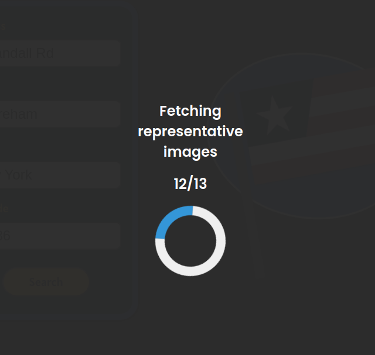

# Find my representatives

See federal, state, city, and local political representatives for any U.S. address 
 

**03-25-2025 update:** *Google has discontinued their Representatives API, effective April 30. The live site has been taken down.* 
 

## Screenshots

## Frameworks, libraries

- Express backend
- Custom JS templating engine
- Node Selenium image scraper
- Socket.io

## Data sources

- Google Civic Information API
- Google Images
